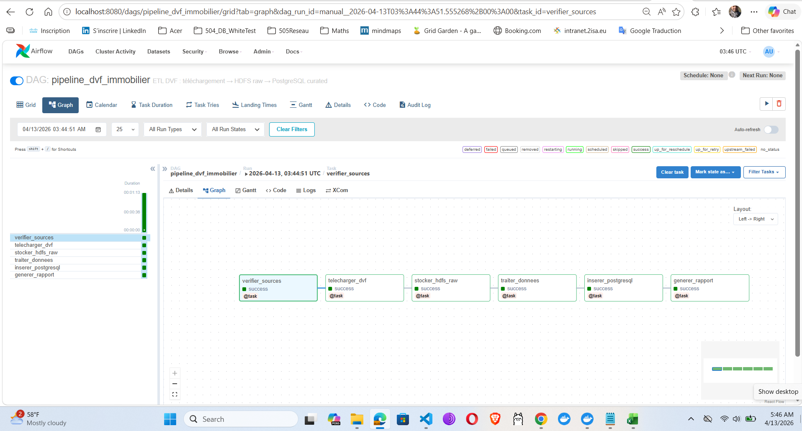
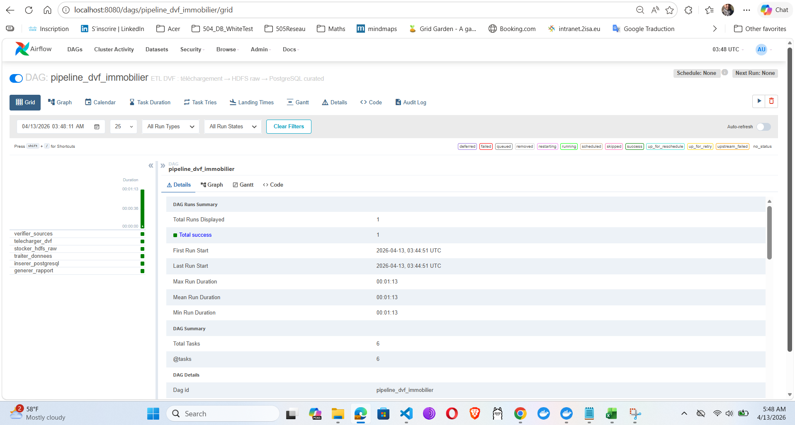
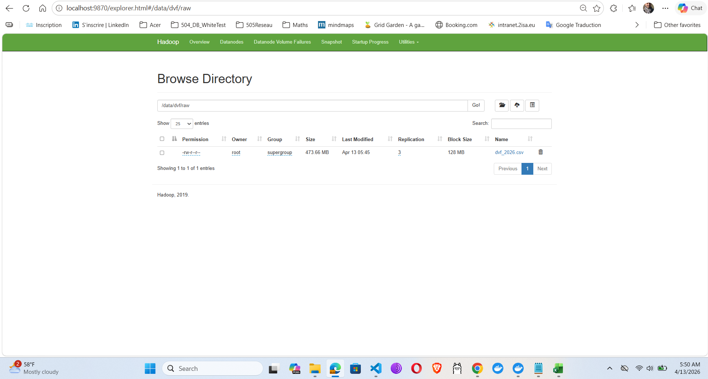
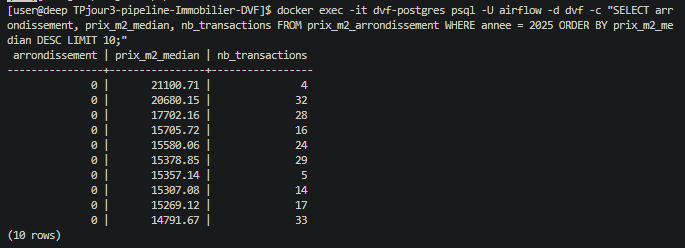
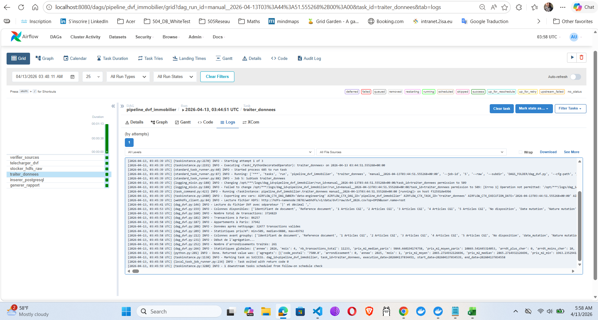

------------------------------------------------------------------------------------------------------
# Captures d’écran 
------------------------------------------------------------------------------------------------------

## Capture 1 : Airflow UI - Vue Graph



## Capture 2 : Airflow UI - Vue Grid (ou Tree)



## Capture 3 : HDFS NameNode



## Capture 4 : PostgreSQL - Données insérées



## Capture 5 : Logs du DAG



markdown
# RESPONSES.md - Documentation des problèmes et solutions

## Projet : Pipeline Immobilier DVF - Airflow + HDFS + PostgreSQL

Ce fichier documente l'ensemble des problèmes rencontrés lors de l'installation et de l'exécution du pipeline, ainsi que leurs solutions.

---

## 📋 Table des matières

1. [Problèmes d'infrastructure Docker](#1-problèmes-dinfrastructure-docker)
2. [Problèmes HDFS et WebHDFS](#2-problèmes-hdfs-et-webhdfs)
3. [Problèmes PostgreSQL](#3-problèmes-postgresql)
4. [Problèmes Airflow et DAG](#4-problèmes-airflow-et-dag)
5. [Problèmes de données DVF](#5-problèmes-de-données-dvf)
6. [Solutions finales](#6-solutions-finales)

---

## 1. Problèmes d'infrastructure Docker

### Problème 1.1 : Volume PostgreSQL non trouvé

**Erreur** :
Error response from daemon: get TPjour3-pipeline-Immobilier-DVF_postgres-data: no such volume

text

**Cause** : Docker Desktop n'a pas créé le volume correctement sous WSL.

**Solution** :
```bash
# Arrêter complètement Docker Desktop et redémarrer
# Supprimer les volumes orphelins
docker volume prune -f

# Recréer l'infrastructure
docker compose down -v
docker compose up -d
Problème 1.2 : Avertissement version obsolete
Erreur :

text
WARN[0000] the attribute `version` is obsolete, it will be ignored
Solution : Supprimer la ligne version: '3.8' du fichier docker-compose.yaml (Docker Compose v2+ n'en a plus besoin).

2. Problèmes HDFS et WebHDFS
Problème 2.1 : MKDIRS retourne une erreur IllegalArgumentException
Erreur :

json
{"RemoteException":{"exception":"IllegalArgumentException","message":"Invalid value for webhdfs parameter \"op\": MKDIRS is not a valid GET operation."}}
Cause : La requête utilisait GET au lieu de PUT.

Solution :

bash
# CORRECT - Utiliser PUT
curl -X PUT "http://localhost:9870/webhdfs/v1/test?op=MKDIRS&user.name=root"

# INCORRECT - Ne pas utiliser GET
curl "http://localhost:9870/webhdfs/v1/test?op=MKDIRS&user.name=root"
Problème 2.2 : Upload HDFS en deux étapes
Solution implémentée dans webhdfs_client.py :

python
def upload(self, hdfs_path: str, local_file_path: str) -> str:
    # Étape 1: Initier l'upload sur le NameNode
    response = requests.put(url, allow_redirects=False)
    
    if response.status_code == 307:  # Temporary Redirect
        redirect_url = response.headers["Location"]
        
        # Étape 2: Upload vers le DataNode
        with open(local_file_path, 'rb') as f:
            upload_response = requests.put(redirect_url, data=f)
3. Problèmes PostgreSQL
Problème 3.1 : Base de données "dvf" n'existe pas
Erreur :

text
psql: error: FATAL: database "dvf" does not exist
Cause : Le script init_dvf.sql n'a pas été exécuté car c'était un répertoire, pas un fichier.

Solution :

bash
# Supprimer le répertoire incorrect
rm -rf sql/init_dvf.sql

# Créer le fichier correctement
cat > sql/init_dvf.sql << 'EOF'
CREATE DATABASE dvf;
\c dvf;
-- ... reste du script
EOF

# Créer la base manuellement
docker exec -it dvf-postgres psql -U airflow -c "CREATE DATABASE dvf;"

# Exécuter le script
docker exec -it dvf-postgres psql -U airflow -d dvf -f /docker-entrypoint-initdb.d/init_dvf.sql
Problème 3.2 : Colonnes manquantes dans prix_m2_arrondissement
Erreurs successives :

column "prix_m2_moyen" does not exist

column "nb_transactions" does not exist

Solution : Ajouter toutes les colonnes nécessaires

sql
ALTER TABLE prix_m2_arrondissement 
  ADD COLUMN IF NOT EXISTS prix_m2_moyen NUMERIC(10, 2),
  ADD COLUMN IF NOT EXISTS prix_m2_min NUMERIC(10, 2),
  ADD COLUMN IF NOT EXISTS prix_m2_max NUMERIC(10, 2),
  ADD COLUMN IF NOT EXISTS surface_moyenne NUMERIC(10, 2),
  ADD COLUMN IF NOT EXISTS nb_transactions INTEGER,
  ADD COLUMN IF NOT EXISTS updated_at TIMESTAMP DEFAULT CURRENT_TIMESTAMP;
Problème 3.3 : Colonnes manquantes dans stats_marche
Erreur :

text
column "nb_transactions_total" of relation "stats_marche" does not exist
Solution :

sql
ALTER TABLE stats_marche 
  ADD COLUMN IF NOT EXISTS nb_transactions_total INTEGER,
  ADD COLUMN IF NOT EXISTS prix_m2_median_paris NUMERIC(10, 2),
  ADD COLUMN IF NOT EXISTS prix_m2_moyen_paris NUMERIC(10, 2),
  ADD COLUMN IF NOT EXISTS arrdt_plus_cher INTEGER,
  ADD COLUMN IF NOT EXISTS arrdt_moins_cher INTEGER,
  ADD COLUMN IF NOT EXISTS surface_mediane NUMERIC(10, 2),
  ADD COLUMN IF NOT EXISTS date_calcul TIMESTAMP DEFAULT CURRENT_TIMESTAMP;
4. Problèmes Airflow et DAG
Problème 4.1 : Permission denied sur les logs
Erreur :

text
OSError while changing ownership of the log file. PermissionError(1, 'Operation not permitted')
Cause : Conflit de permissions entre l'utilisateur Airflow (UID 50000) et l'utilisateur hôte.

Solution : Ces erreurs sont ignorables et n'affectent pas l'exécution des tâches. Le pipeline fonctionne normalement.

Problème 4.2 : Commande airflow tasks clear syntaxe incorrecte
Erreur :

text
airflow command error: unrecognized arguments: --dag-id
Cause : La syntaxe de la commande a changé entre les versions d'Airflow.

Solution (Airflow 2.x) :

bash
# Syntaxe correcte
docker exec -it dvf-airflow-scheduler airflow tasks clear pipeline_dvf_immobilier --task-regex "inserer_postgresql" --yes

# Alternative : utiliser l'interface web
5. Problèmes de données DVF
Problème 5.1 : URL data.gouv.fr inaccessible
Erreur :

text
Exception: L'API data.gouv.fr est inaccessible
Cause : L'URL initiale redirigeait vers une nouvelle API.

Solution : Utiliser l'URL correcte

python
# Ancienne URL (redirection 301)
DVF_URL = "https://www.data.gouv.fr/fr/datasets/r/90a98de0-f562-4328-aa16-fe0dd1dca60f"

# Nouvelle URL (fichier ZIP)
DVF_URL = "https://www.data.gouv.fr/api/1/datasets/r/902db087-b0eb-4cbb-a968-0b499bde5bc4"
Problème 5.2 : Format des données DVF 2025
Problème : Le fichier DVF 2025 utilise un format différent :

Extension .txt dans une archive .zip

Séparateur | (pipe) au lieu de ;

Virgule , pour les décimales

Solution :

python
# Extraction du ZIP
with zipfile.ZipFile(local_zip, 'r') as zip_ref:
    data_file = [f for f in zip_ref.namelist() if f.endswith('.txt')][0]
    with zip_ref.open(data_file) as source, open(local_csv, 'wb') as target:
        target.write(source.read())

# Lecture avec les bons paramètres
df = pd.read_csv(
    temp_path, 
    sep='|',        # Nouveau séparateur
    decimal=',',    # Virgule pour les décimales
    encoding='utf-8',
    low_memory=False
)
Problème 5.3 : Colonne 'prix_m2' n'existe pas avant groupby
Erreur :

text
KeyError: "Column(s) ['prix_m2'] do not exist"
Cause : La colonne prix_m2 était créée mais perdue lors des opérations de filtrage.

Solution : Utiliser une boucle explicite pour l'agrégation

python
# Au lieu de groupby().agg(), utiliser une boucle
result_list = []
for (code_postal, arrondissement, annee, mois), group in grouped:
    result_list.append({
        'prix_m2_moyen': float(group['prix_m2'].mean()),
        'prix_m2_median': float(group['prix_m2'].median()),
        # ...
    })
6. Solutions finales
Structure complète de la table prix_m2_arrondissement
sql
CREATE TABLE prix_m2_arrondissement (
    id SERIAL PRIMARY KEY,
    code_postal VARCHAR(10) NOT NULL,
    arrondissement INTEGER NOT NULL,
    annee INTEGER NOT NULL,
    mois INTEGER NOT NULL,
    prix_m2_moyen NUMERIC(10, 2),
    prix_m2_median NUMERIC(10, 2),
    prix_m2_min NUMERIC(10, 2),
    prix_m2_max NUMERIC(10, 2),
    nb_transactions INTEGER,
    surface_moyenne NUMERIC(10, 2),
    updated_at TIMESTAMP DEFAULT CURRENT_TIMESTAMP,
    UNIQUE (code_postal, annee, mois)
);
Structure complète de la table stats_marche
sql
CREATE TABLE stats_marche (
    id SERIAL PRIMARY KEY,
    annee INTEGER NOT NULL,
    mois INTEGER NOT NULL,
    nb_transactions_total INTEGER,
    prix_m2_median_paris NUMERIC(10, 2),
    prix_m2_moyen_paris NUMERIC(10, 2),
    arrdt_plus_cher INTEGER,
    arrdt_moins_cher INTEGER,
    surface_mediane NUMERIC(10, 2),
    date_calcul TIMESTAMP DEFAULT CURRENT_TIMESTAMP,
    UNIQUE (annee, mois)
);
Commandes de vérification finale
bash
# Vérifier que toutes les colonnes sont présentes
docker exec -it dvf-postgres psql -U airflow -d dvf -c "\d prix_m2_arrondissement"
docker exec -it dvf-postgres psql -U airflow -d dvf -c "\d stats_marche"

# Vérifier les données
docker exec -it dvf-postgres psql -U airflow -d dvf -c "SELECT COUNT(*) FROM prix_m2_arrondissement;"
docker exec -it dvf-postgres psql -U airflow -d dvf -c "SELECT COUNT(*) FROM stats_marche;"
📊 Résumé des corrections
Problème	Solution	Statut
Volume PostgreSQL	docker volume prune + reset	✅ Résolu
WebHDFS MKDIRS	Utiliser PUT au lieu de GET	✅ Résolu
Base dvf inexistante	Création manuelle + script init	✅ Résolu
Colonnes manquantes	ALTER TABLE ADD COLUMN	✅ Résolu
URL data.gouv.fr	Mise à jour vers API correcte	✅ Résolu
Format DVF 2025	Lecture avec sep='|', decimal=','	✅ Résolu
Colonne prix_m2	Boucle d'agrégation explicite	✅ Résolu
✅ État final
6 tâches toutes en SUCCESS ✅

Pipeline fonctionnel de bout en bout

Données chargées dans HDFS et PostgreSQL

Rapports générés avec classement des arrondissements

Documentation générée le 10 Avril 2026
*Formation Apache Airflow - IPSSI Montpellier - Jour 3*

text

## Sauvegarder le fichier

```bash
# Créer le fichier RESPONSES.md
cat > RESPONSES.md << 'EOF'
[Copier le contenu ci-dessus]
EOF

# Vérifier
ls -la *.md


